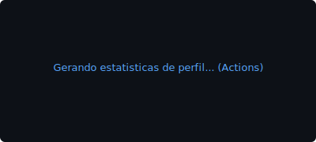
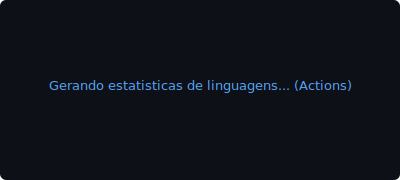
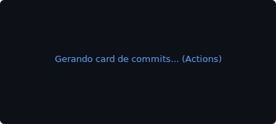
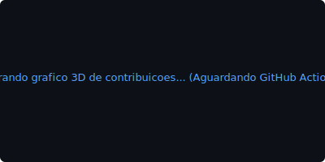

<p align="center">
  
</p>

<p align="center">
  <a href="https://git.io/typing-svg">
    
  </a>
</p>

<p align="center">
  
  
  
  
  
</p>

<p align="center">
  
</p>

---

## 🙋‍♂️ Quem eu sou
**Mailor Jorge** — engenheiro de software e modder focado em construir soluções robustas de tempo real, telemetria logística distribuída (Séquito SaaS) e estender engines de jogos por meio de engenharia de script nativa (Papyrus/C++). 

**Proposta de valor:** Desenvolver produtos e integrações que otimizam fluxos operacionais e automatizam experiências complexas, transitando com fluidez entre arquiteturas fullstack de alta escalabilidade na web e lógica de baixo nível.

| Sinal | Evidência |
| :--- | :--- |
| **Produto âncora** | **Séquito** — SaaS de Delivery, PDV & Logística em Tempo Real (~70% do roadmap v1.0) |
| **Domínio principal** | Frontend Operacional · Logística Realtime · Modding Engine de Jogos (Papyrus/C++) |
| **Contribuições em Modding** | Desenvolvimento de menus MCM customizados com SkyUI vanilla, extensões de gameplay no Skyrim |
| **Conta GitHub** | Foco em engineering real, automações de build (APK standalone, workflows) e open-source |

---

## 🏛️ Domínios (Engenharia de Impacto)

| Domínio | O que entrego |
| :--- | :--- |
| **Client Engineering** | Dashboards operacionais responsivos, Next.js 16 (App Router), React 19, KDS e PDV local. |
| **Mobile Field Ops** | App do motoboy nativo com Expo, persistência de credenciais criptografadas e telemetria resiliente. |
| **Realtime Logistics** | Sincronia GPS em tempo real, roteamento (OSRM, geocodificação resiliente) e indexação geográfica com Uber H3. |
| **Game Engineering** | Engenharia reversa de scripts `.pex` (Champollion), desenvolvimento de menus MCM Vanilla via SkyUI. |
| **Platform & Security** | Supabase RLS multi-tenant, autenticação segura, e tratamento resiliente com ErrorBoundaries em boot nativo. |

<details>
<summary>🛠️ <strong>Tech Stack Completa</strong> (Clique para expandir)</summary>
<br>

*   **Languages:** TypeScript, JavaScript, C++, Python, Papyrus Scripting (Skyrim).
*   **Web Frameworks:** Next.js (App Router), React, Tailwind CSS v4, Express, Node.js.
*   **Mobile Technologies:** Expo Standalone, React Native, Expo Location, Background Tracking.
*   **Databases & Real-time:** PostgreSQL, Supabase RLS, Redis (ioredis), BullMQ, Centrifuge.
*   **DevOps & Security:** GitHub Actions, Docker, Docker Compose, ESLint (Flat Config), Prettier.
*   **Modding Frameworks:** MCM Helper, SkyUI API, PapyrusUtil, UIExtensions, Campfire, Frostfall.

</details>

---

## 🛠️ Skills (Nível Operacional)

```
TypeScript  ██████████████████████████ 85%
Next.js     ██████████████████████░░░░ 75%
Expo/Mobile ████████████████████░░░░░░ 65%
Papyrus/C++ ██████████████████████░░░░ 75%
Supabase/DB ██████████████████████░░░░ 75%
```

---

## 🚀 Projetos em Destaque

*   **[projeto-ifood → Séquito](https://github.com/evertonfridrich-ops/projeto-ifood)**: SaaS completo de delivery com painel KDS, despacho automatizado, robô iFood e aplicativo nativo de motoboys.
*   **Skyrim Modding Toolkit**: Scripts Papyrus customizados de alta performance para mecânicas de gameplay, menus MCM vanilla construídos sob o framework nativo do SkyUI.

---

## 📊 Estatísticas Estáticas & Dinâmicas

<p align="center">
  
  
</p>

<p align="center">
  
</p>

<p align="center">
  
</p>

---

## 🎨 Engenharia Visual Avançada

### 🐍 Contribution Snake
*Atualizado automaticamente a cada 12h via GitHub Actions*

<p align="center">
  <picture>
    <source media="(prefers-color-scheme: dark)" srcset="https://raw.githubusercontent.com/Mailor-Jorge/Mailor-Jorge/output/github-contribution-grid-snake-dark.svg" />
    <source media="(prefers-color-scheme: light)" srcset="https://raw.githubusercontent.com/Mailor-Jorge/Mailor-Jorge/output/github-contribution-grid-snake.svg" />
    
  </picture>
</p>

### 📊 Gráfico 3D de Contribuições
<p align="center">
  
</p>

<p align="center">
  <a href="https://skyline.github.com/Mailor-Jorge/2026">🏙️ GitHub Skyline 2026</a>
</p>

<p align="center">
  
</p>

<p align="center">
  <sub>Built with institutional engineering standards · Sequito 2026</sub>
</p>
