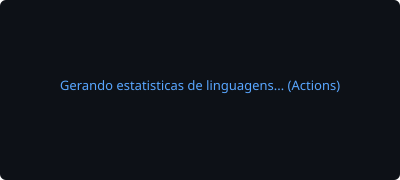
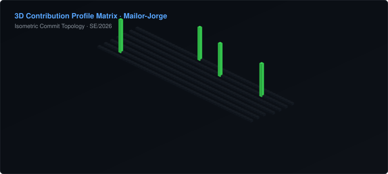

<p align="center">
  
</p>

<p align="center">
  <a href="https://git.io/typing-svg">
    
  </a>
</p>

<p align="center">
  
  
  
  
  
  
</p>

<p align="center">
  
</p>

---

## 🙋‍♂️ Quem eu sou
**Mailor Jorge** — engenheiro de software, arquiteto de sistemas e modder focado em engenharia de IA e otimização de agentes (HYDRA Framework), governança institucional de repositórios (AGPL-3.0, SBOM, DevSecOps) e extensão de engines de jogos por meio de engenharia de script nativa de alta performance (Papyrus/C++).

**Proposta de valor:** Construir arquiteturas de software seguras, auditáveis e de alto rendimento — automatizando fluxos operacionais complexos, reduzindo drasticamente custos de computação em IA e transitando com fluidez entre lógica de baixo nível e ecossistemas fullstack escaláveis.

| Sinal | Evidência |
| :--- | :--- |
| **Framework Âncora** | **[HYDRA Tokens Antigravity](https://github.com/Mailor-Jorge/hydra-tokens-antigravity)** — Sistema modular de redução de tokens em IA (9 Heads, MCP, AGPL-3.0) |
| **Domínio Principal** | Otimização de Agentes IA · Governança Institucional de Software · Game Engine Modding (Papyrus/C++) · Full Stack |
| **Engenharia de Jogos** | Sistemas nativos de gameplay para Skyrim (Bounty Hunter Board, Arcadia Professions, Menus MCM Vanilla SkyUI) |
| **Governança & Open-Source** | Protocolo Institucional Master (AGPL-3.0-only dual licensing, SBOM SPDX, auditoria forense, CI/CD) |

---

## 🏛️ Domínios (Engenharia de Impacto)

| Domínio | O que entrego |
| :--- | :--- |
| **AI Systems & Token Optimization** | Arquitetura modular de agentes IA (HYDRA), otimização de contextos, seleção dinâmica de MCP tools (-96% input tokens) e mitigação de saturação de contexto. |
| **Institutional Governance & Security** | Governança institucional de repositórios, conformidade e licenciamento duplo (AGPL-3.0), custódia forense (.evidence), SBOM (SPDX) e DevSecOps. |
| **Client & Backend Engineering** | Dashboards operacionais responsivos, Next.js (App Router), React, TypeScript, APIs resilientes e arquiteturas orientadas a eventos. |
| **Game Engineering & Modding** | Engenharia de gameplay nativa em Skyrim (Papyrus, C++), menus MCM Vanilla via SkyUI, engenharia reversa de bytecode `.pex` (Champollion) e integração de mecânicas de RPG. |
| **Platform & Database Architecture** | Modelagem relacional PostgreSQL, Supabase RLS multi-tenant, caching distribuído com Redis, conteinerização Docker e esteiras GitHub Actions. |

<details>
<summary>🛠️ <strong>Tech Stack Completa</strong> (Clique para expandir)</summary>
<br>

*   **Languages:** TypeScript, JavaScript, Python, C++, Papyrus Scripting (Skyrim).
*   **AI & Optimization:** Google Antigravity, Framework HYDRA (9 Heads), MCP (Model Context Protocol), Context Guard, Prompt Optimization.
*   **Institutional Governance:** AGPL-3.0 Dual Licensing, SPDX SBOM, Custódia Forense, GitHub Actions CI/CD, CLA/CCLA, DevSecOps.
*   **Web Frameworks:** Next.js (App Router), React, Tailwind CSS v4, Node.js, Express.
*   **Databases & Cache:** PostgreSQL, Supabase RLS, Redis (ioredis), BullMQ.
*   **DevOps & Tools:** GitHub Actions, Docker, Docker Compose, Git Forensics, ESLint, Prettier.
*   **Game Modding:** Creation Kit, SkyUI API, PapyrusUtil, Champollion, Skyrim Special Edition Scripting Engine.

</details>

---

## 🛠️ Skills (Nível Operacional)

```
TypeScript / Fullstack      ██████████████████████████ 85%
AI & Token Optimization     ████████████████████████░░ 80%
Repository Governance & CI  ████████████████████████░░ 80%
Papyrus / Game Engineering  ██████████████████████░░░░ 75%
Databases & Cloud (Postgres)██████████████████████░░░░ 75%
Python                      ████████████████████░░░░░░ 70%
```

---

## 🚀 Projetos em Destaque

*   **[HYDRA Tokens Antigravity](https://github.com/Mailor-Jorge/hydra-tokens-antigravity)**: Framework institucional modular de 9 cabeças (Skills, Rules, MCP, Agents) projetado para reduzir o consumo de tokens em até 90% em ambientes de IA (Google Antigravity IDE). Governança com AGPL-3.0-only dual-licensing, SBOM SPDX, auditoria forense e ferramentas de seleção dinâmica.
*   **Skyrim Modding Toolkit & Gameplay Systems**: Desenvolvimento de scripts Papyrus de alta performance e baixo overhead, painéis de recompensas e progressão (*Bounty Hunter Board*, *Arcadia Professions*), e integração nativa com o framework SkyUI MCM vanilla API.

---

## 📊 Estatísticas Estáticas & Dinâmicas

<p align="center">
  
  
</p>

<p align="center">
  
</p>

<p align="center">
  
</p>

---

## 🎨 Engenharia Visual Avançada

### 🐍 Contribution Snake
*Atualizado automaticamente a cada 12h via GitHub Actions*

<p align="center">
  <picture>
    <source media="(prefers-color-scheme: dark)" srcset="https://raw.githubusercontent.com/Mailor-Jorge/Mailor-Jorge/output/github-contribution-grid-snake-dark.svg" />
    <source media="(prefers-color-scheme: light)" srcset="https://raw.githubusercontent.com/Mailor-Jorge/Mailor-Jorge/output/github-contribution-grid-snake.svg" />
    
  </picture>
</p>

### 📊 Gráfico 3D de Contribuições
<p align="center">
  
</p>

<p align="center">
  <a href="https://skyline.github.com/Mailor-Jorge/2026">🏙️ GitHub Skyline 2026</a>
</p>

<p align="center">
  
</p>

<p align="center">
  <sub>Built with institutional engineering standards · Mailor Jorge 2026</sub>
</p>
